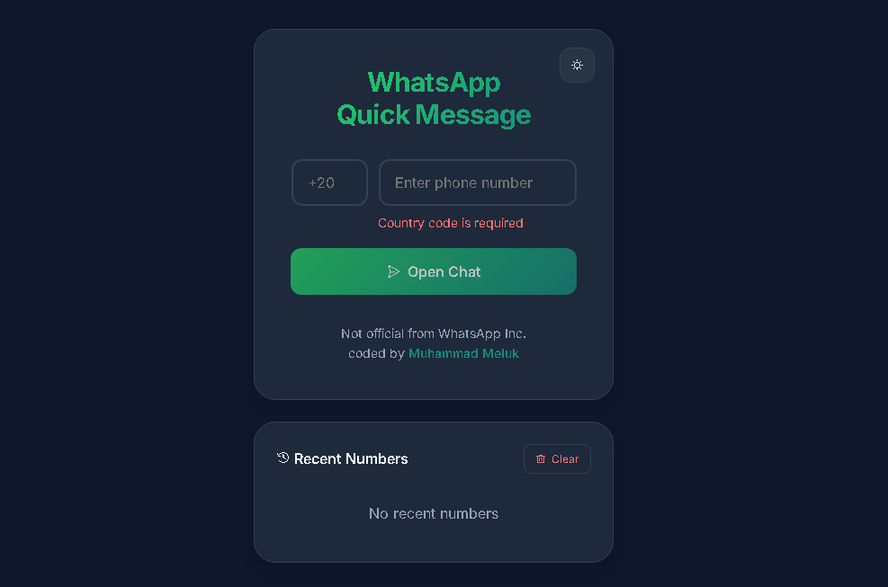

# WhatsApp Quick Message 📱

A sleek web application that allows users to instantly open WhatsApp chats with any phone number without saving contacts. Built with modern web technologies and a focus on user experience.

## ✨ Features

- 🌐 Direct WhatsApp chat opener without saving contacts
- 🌙 Dark/Light theme support
- 📱 Mobile-responsive design
- 🔄 Recent numbers history
- ✅ Phone number validation
- 🌍 International format support
- 💾 Local storage for recent numbers
- 🎨 Modern, clean UI

## 🛠️ Technologies Used

- HTML5
- CSS3 (Custom properties, Flexbox)
- JavaScript (ES6+)
- Local Storage API
- WhatsApp Web API

## 💡 Usage

1. Enter the country code (e.g., +1 for USA)
2. Input the phone number
3. Click "Open Chat" or hit "Enter" to start a WhatsApp conversation
4. Recent numbers are automatically saved for quick access

## 👨‍💻 Developer

- **Muhammad Meluk**
  - Portfolio: [https://msmelok.github.io/R4_2.0](https://msmelok.github.io/R4_2.0)

## 📝 License

This project is licensed under the MIT License - see the [LICENSE](LICENSE) file for details.

## ⚠️ Disclaimer

This project is not officially associated with WhatsApp Inc. It's an independent tool created to enhance the WhatsApp web experience.
